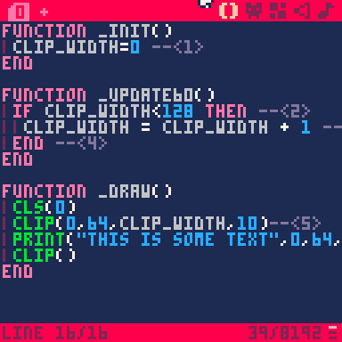
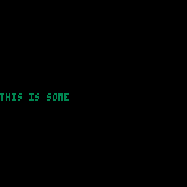
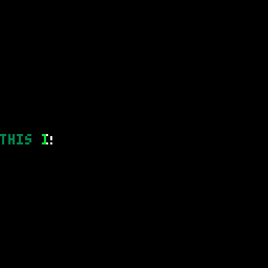
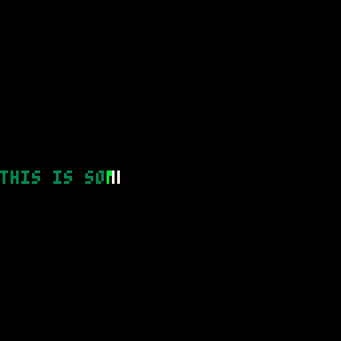
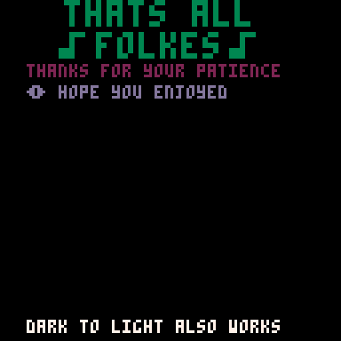

= Creating a text effect
:icons: font
:source-highlighter: coderay
:toc: auto

It is nice to add some text effects to our pico-8 games they give a sense of life to our games.

There are many ways to add effects, but I'd like to show you how I went about producing the following effect.

.Fig 1 - Target Effect
image:shine-cropped.gif[Example output]

== Breaking Down the problem
To create the desired effect we need some way of printing partial text. I.e. to cut a character in the middle.

The easiest way I can find to do this is to use the `clip` command.

Let's start with a simple cart that just displays some text that we want in the middle of the screen.

.Listing 1 - Printing in middle of screen
[source,lua]
----
function _init() -- <1>
end

function _update60() -- <2>
end

function _draw() -- <3>
	cls(0) -- <4>
	print("this is some text",0,64,3) -- <5>
end
----
<1> Standard pico 8 function runs on cart startup usually used to initialize variables.
<2> Used during the update phase of the cart. The 60 variant is used to make a smoother effect. `_update()` would work also, however.
<3> Draw function called 60 times a second to draw our cart
<4> Clears the screen to black every frame
<5> Prints some text in dark green at the left vertical middle of our cart.

== Playing With Clip
The `clip()` command can be used to make sure that we are only drawing to a certain part of the screen.

The arguments to clip are as follows:

.Table 1 - Clipping arguments
[horizontal]
X:: The x position that we will draw from.
Y:: The y position that we will draw from.
W:: The width in pixels that we crop to.
H:: The height in pixels that we crop to.
CLIP_PREVIOUS:: Not used in this project.
    If `true` then the current clipping region is the intersection between the previous clip command and the current clip command. Usually this is not necessary.

After the clip command has been issued then all future graphics functions within the same frame are clipped to the region specified.

We can use the power of this command to give us the first part of our puzzle.  How to draw a partial letter and how to increase the draw region.

Let's change our listing to include a clipping region

.Listing 2 - clipping some text
[source, lua]
----
function _init()
end

function _update60()
end

function _draw()
	cls(0)
	clip(0,64,34,10) -- <1>
	print("this is some text",0,64,3)
	clip() -- <2>
end
----
<1> Set the clipping region to `x=0` _(left of screen)_ , `y=64` _(vertical position of text)_, `w=34` _(only draw 34 pixels of the text)_,  `h=10` _(Only draw ten pixels high)_
<2> Resets the clipping region so no other graphics functions are effected.

As you can see this effectively cuts off what we print and is exactly what is needed to start producing our effect.

=== Exercises
1. Try moving the clipping region so that you can only see the word `some`.
2. Try clipping more than one line of text.
3. If you know looping structures try making the clipping region start from nothing at the left gradually increasing per frame until it shows the
entire text. _**Answer in next section**_

== Animating the clipping region
To animate the text slowly expanding we need to use variables.

We are going to do the following:

* Set a global variable that sets the current clipping region.
* Every frame increment this value until it reaches the right of the screen.
* Change the clip to use this variable.

.Listing 3 - animating clip region
[source,lua]
----
function _init()
	clip_width=0 --<1>
end

function _update60()
	if clip_width<128 then --<2>
		clip_width = clip_width + 1 --<3>
	end --<4>
end

function _draw()
	cls(0)
	clip(0,64,clip_width,10)--<5>
	print("this is some text",0,64,3)
	clip()
end
----
<1> Sets up a global variable to 0 for the clip width
<2> Checks if the width is less than the full width of the screen.
<3> Increments the clipping region
<4> Ends the `if` condition
<5> Now uses the `clip_width` variable to specify the height of the clipping

=== Result
To see the result of this you can copy the code into pico-8, and you can run it by pressing `CTRL+R`. You can also restart it by pressing `CTRL+R` pressing `ESC` Twice will bring you back to the code editor.

.Fig 2 - Animated clipping

=== Exercises

1. Try adding another text to animate.
2. The current listing clips to the full width of the screen.
    However, the text takes up less room than the full width of the screen.
3. The current listing has one variable for width.
    If you had more than one line of text how would you animate these separately?
4. Try repeating the clipping animation when finished.
5. Try reversing the animation once the full line is displayed.
6. Try adding a second or third colour to the animation (effectively finish the animation by yourself)
7. Try changing the speed of the animation.

== Making reusable

So that we can animate more than one set of text at different points we are going to do the following:

* Separate the creation of the text from the animation. This implies keeping more than one text and position in memory.
* Specifying the correct width of the effect.

To do this we are going to store the following properties separately for
each piece of text.

[horizontal]
TXT:: The text to be displayed
X:: The horizontal position of the text
Y:: The vertical position of the text.
W:: The width of the text.
H:: The height of the text.
CURR_W:: The current width of the text position.

We are also going to use the fact that print returns the right most and bottom most pixels of the text printed to use accurate width and height.

[source, lua]
----
function _init() 
	texts={}--<1>
	--creates the initial text
	--and adds to the texts
	add(texts, --<2>
		create_s_txt( --<3>
			"this is some text",0,64))
	
end

function _update60()
	--loop through all texts
	for stext in all(texts) do --<4>
		--increment curr_w if less
		--than w
		if stext.curr_w<stext.w then
			stext.curr_w+=1 
		end
	end
end

function _draw()
	cls(0)
	--loop through all texts
	for t in all(texts) do
		--increment curr_w if less
		--than w
		clip(t.x,t.y,t.curr_w,t.h)--<5>
		print(t.txt,t.x,t.y,3)
		clip()
	end
end

function create_s_txt(txt,x,y) --<6>
	--don't draw anything
	clip(0,0,0,0)
	--print at 0,0 keep w and h
	local w,h=print(txt,0,0) --<7>
	--reset clip to not interfere
	clip()
	return {
		txt=txt, --<8>
		x=x,
		y=y,
		w=w,
		h=h,
		curr_w=0}
end
----
<1> Creates a new table to store all texts in.
<2> Add the existing text to the new table.
<3> Calls a function to return the properties of the text, see <6> also
<4> loops through all texts.
<5> Uses the properties of the current text to set the clipping region.
<6> Puts the creation to a function so that it can be reused.
<7> Prints the text at 0,0 but fully clipped so no display is updated. This is just called to get the height and the width of the text.

== Extracting the text draw and update
It makes it cleaner if the logic for drawing the shiny text (stext) is not in the `_init` or _`draw` function. First we will change the loops to use functions.

Afterwards we will change the type of loop used.

=== Extracting draw and update
[source, lua]
----
function _init()
	texts={}
	--creates the initial text
	--and adds to the texts
	add(texts,
		create_s_txt(
			"this is some text",0,64))
	
end

function _update60()
	--loop through all texts
	for stext in all(texts) do
		update_s_txt(stext) --<1>
	end
end

function _draw()
	cls(0)
	--loop through all texts
	for t in all(texts) do
		draw_s_txt(t) --<2>
	end
end

function create_s_txt(txt,x,y)
	--don't draw anything
	clip(0,0,0,0)
	--print at 0,0 keep w and h
	local w,h=print(txt,0,0)
	--reset clip to not interfere
	clip()
	return {
		txt=txt,
		x=x,
		y=y,
		w=w,
		h=h,
		curr_w=0}
end

function update_s_txt(stext) --<3>
	--increment curr_w if less
	--than w
	if stext.curr_w<stext.w then
		stext.curr_w+=1 
	end
end

function draw_s_txt(t)--<4>
	--increment curr_w if less
	--than w
	clip(t.x,t.y,t.curr_w,t.h)
	print(t.txt,t.x,t.y,3)
	clip()
end
----
<1> Call a function to update
<2> Call a function to draw
<3> Extracted update stext function
<4> Extracted draw stext function

=== Changing loop type
To change the loop type we only need to change the `_update` and `_draw` function.  This is a partial listing.

[source, lua]
----
function _update60()
	--update all stexts
	foreach(texts, update_s_txt)--<1>
end

function _draw()
	cls(0)
	--draw all stexts
	foreach(texts, draw_s_txt)
end
----

<1> This loops through all texts and calls the function update_s_txt passing each `text`.

=== Adding additional texts
This is not really part of the code for handling, but it is useful for testing.

When the player presses (x) then we will add a random text. When they press z then we will clear all texts.

Again this is partial code
[source, lua]
----
function _update60()
	--update all stexts
	foreach(texts, update_s_txt)
	
	rtexts={
	"cows drink water",
	"humans drink milk",
	[[multiline
	strings should
	work]]} --<1>
	if btnp(❎) then
		local txt=create_s_txt(
			rnd(rtexts),rnd(64),rnd(110)) --<2>
		add(texts, txt)--<3>
	end
	if btnp(🅾️) then
		texts={}--<4>
	end
end
----
<1> creates a table of values that we can select from
<2> creates a stext with a random x, y and text
<3> adds the new text to the texts array
<4> clears the existing text array

.Fig 3 - Multiple texts

== Adding Shine
To add a "shine" to the text we need to think about colours.
There are several light to dark gradients that are available in pico-8.

I like using the white / light green / green gradient for the feeling of old consoles however there is many other gradients that work.

Some that work well are:

* 7 White, 11 Lime Green, 3 Dark Green
* 7 White, 14 Pink, 8 Red
* 14 Pink, 8 Red, 2 Wine
* 7 White, 12 Bright Blue, 13 Blue Grey

I'm going to focus on the first 1.

The idea is you clip the text 3 times.
1 Draw the text up to the current clipping region in the light colour
2 Draw the text up to the current clipping region -3 in the mid colour
3 Draw the text up to the current clipping region -6 in the dark colour.

[source, lua]
----
function draw_s_txt(t)
	--light medium dark
	local l,m,d=7,11,3
	clip(t.x,t.y,t.curr_w,t.h)
	print(t.txt,t.x,t.y,l)
	clip(t.x,t.y,t.curr_w-3,t.h)
	print(t.txt,t.x,t.y,m)
	clip(t.x,t.y,t.curr_w-6,t.h)
	print(t.txt,t.x,t.y,d)
	clip()
end
----

This leaves us with a problem however as the shine never leaves the text fully.  To compensate with this we need to add 6 pixels to the width.

.Fig 4 - Shine effect but unfinished

Let's fix that now, we only need a tiny adjustment to our `create_s_txt` function.

[source, lua]
----
function create_s_txt(txt,x,y)
	--don't draw anything
	clip(0,0,0,0)
	--print at 0,0 keep w and h
	local w,h=print(txt,0,0)
	--reset clip to not interfere
	clip()
	return {
		txt=txt,
		x=x,
		y=y,
		w=w+6, --<1>
		h=h,
		curr_w=0}
end
----
<1> Add six pixels to compensate for the fact we finish drawing early

.Fig 5 - Fixed shine function.

=== Exercises
1. Add in a way to specify the colour gradient that you want.

=== Current Complete code
[source, lua]
----
function _init()
	texts={}
	--creates the initial text
	--and adds to the texts
	add(texts,
		create_s_txt(
			"this is some text",0,64))

end

function _update60()
	--update all stexts
	foreach(texts, update_s_txt)

	rtexts={
	"cows drink water",
	"humans drink milk",
	[[multiline
	strings should
	work]]}
	if btnp(❎) then
		local txt=create_s_txt(
			rnd(rtexts),rnd(64),rnd(110))
		add(texts, txt)
	end
	if btnp(🅾️) then
		texts={}
	end
end

function _draw()
	cls(0)
	--draw all stexts
	foreach(texts, draw_s_txt)
end

function create_s_txt(txt,x,y)
	--don't draw anything
	clip(0,0,0,0)
	--print at 0,0 keep w and h
	local w,h=print(txt,0,0)
	--reset clip to not interfere
	clip()
	return {
		txt=txt,
		x=x,
		y=y,
		w=w+6,
		h=h,
		curr_w=0}
end

function update_s_txt(stext)
	--increment curr_w if less
	--than w
	if stext.curr_w<stext.w then
		stext.curr_w+=1
	end
end

function draw_s_txt(t)
	--light medium dark
	local l,m,d=7,11,3
	clip(t.x,t.y,t.curr_w,t.h)
	print(t.txt,t.x,t.y,l)
	clip(t.x,t.y,t.curr_w-3,t.h)
	print(t.txt,t.x,t.y,m)
	clip(t.x,t.y,t.curr_w-6,t.h)
	print(t.txt,t.x,t.y,d)
	clip()
end
----

== Final Steps - Cleanup
In the final steps, I'm going to remove the debug methods, allow for different colour tables to be made, and reduce the tokens for `draw_s_txt`.

Finally, I'm going to make it say the text that I like.

Firstly let's add in the colour tables to the `create_s_txt` function.

[source, lua]
----
--[[
creates shiny text
takes text, x, y and an
optional table of colours]]
function create_s_txt(
	txt,x,y,cols)
	--if no colours use green
	cols=cols or split("7,11,3")--<1><2>
	--don't draw anything
	clip(0,0,0,0)
	--print at 0,0 keep w and h
	local w,h=print(txt,0,0)
	--reset clip to not interfere
	clip()
	return {
		txt=txt,
		x=x,
		y=y,
		w=w+(#cols-1)*3, --<3>
		h=h,
		curr_w=0,
		cols=cols--<4>
		}
end
----
<1> If `cols` argument isn't defined then used a default table. This could also have been written as `cols=cols or {7,11,3}`
<2> If your project always uses the same colours you can hard code and remove the argument to save tokens.
<3> As more colours could be passed we need to calculate the extra pixel size.
<4> Add in the colours table to the array

Now let's simplify the `draw_s_txt` function to have fewer tokens and use a smarter table system.

[source, lua]
----
function draw_s_txt(t)
	--light medium dark
	local cols=t.cols --<1>
	for i=0,#cols-1 do
		clip(t.x,t.y,t.curr_w-3*i,t.h) --<2>
		print(t.txt,t.x,t.y,cols[i+1]) --<3>
	end
	clip()
end
----
<1> Assigning to a local variable makes it easier to read
<2> We clip based on the index.
<3> Select the colour from the colours table.

=== Remove of debug and final output

No need to explain anything but here is the full final cart.

.Final Listing
[source,lua]
----
function _init()
	texts={}
	--creates the initial text
	--and adds to the texts
	add(texts,
		create_s_txt(
			"\^t\^wthats all",24,0))
	add(texts,
		create_s_txt(
			"\^t\^w♪folkes♪",20,12))
	add(texts,
		create_s_txt(
			"thanks for your patience"
			,10,24, {7,14,8,4,2}))
	add(texts,
		create_s_txt(
			"☉ hope you enjoyed"
			,10,32, {7,12,13}))

	add(texts,
		create_s_txt(
			"dark to light also works"
			,10,120, {1,5,13,6,7}))

end

function _update60()
	--update all stexts
	foreach(texts, update_s_txt)
end

function _draw()
	cls(0)
	--draw all stexts
	foreach(texts, draw_s_txt)
end

--[[
creates shiny text
takes text, x, y and an
optional table of colours]]
function create_s_txt(
	txt,x,y,cols)
	--if no colours use green
	cols=cols or split("7,11,3")
	--don't draw anything
	clip(0,0,0,0)
	--print at 0,0 keep w and h
	local w,h=print(txt,0,0)
	--reset clip to not interfere
	clip()
	return {
		txt=txt,
		x=x,
		y=y,
		w=w+(#cols-1)*3,
		h=h,
		curr_w=0,
		cols=cols
		}
end

function update_s_txt(stext)
	--increment curr_w if less
	--than w
	if stext.curr_w<stext.w then
		stext.curr_w+=1
	end
end

function draw_s_txt(t)
	--light medium dark
	local cols=t.cols
	for i=0,#cols-1 do
		clip(t.x,t.y,t.curr_w-3*i,t.h)
		print(t.txt,t.x,t.y,cols[i+1])
	end
	clip()
end
----

.Fig 6 - Final output

